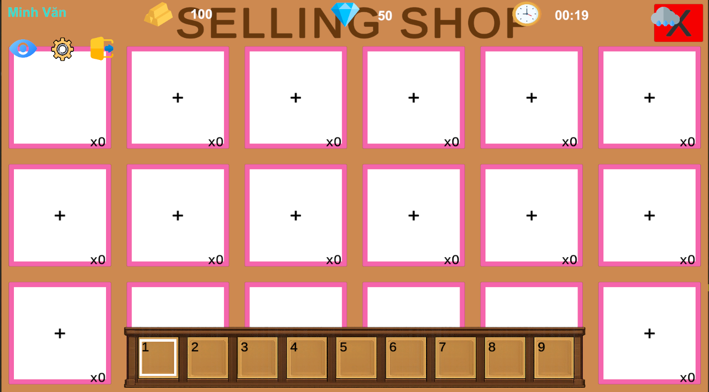

# 🌾 Modern Farm - Dự Án Game Nông Trại 2D

**Modern Farm** là một trò chơi mô phỏng quản lý nông trại 2D được phát triển bằng Unity. Người chơi sẽ vào vai một người nông dân hiện đại, thực hiện các công việc từ trồng trọt, chăn nuôi đến kinh doanh nông sản, tất cả dữ liệu được đồng bộ hóa trực tuyến qua Firebase.

---

## 📸 Hình ảnh & Demo


### 1. Màn hình Đăng nhập & Đăng ký
  
*(Giao diện xác thực người dùng qua Firebase Auth)*

### 2. Trồng trọt & Thu hoạch
  
*(Hệ thống Tilemap tương tác: cuốc đất, gieo hạt, tưới nước)*

### 3. Hệ thống Cửa hàng & Sạp hàng
  
*(Nơi người chơi bày bán nông sản để kiếm Vàng và Kim cương)*

---

## 🎮 Hướng dẫn chơi (How to Play)

### Phím điều khiển
- **`W`, `A`, `S`, `D`**: Di chuyển nhân vật.
- **`Phím Cách (Space)`**: Tương tác chính (Sử dụng công cụ đang cầm).
- **`B` hoặc `Tab`**: Đóng/Mở túi đồ (Inventory).
- **`Phím 1 - 9`**: Chọn nhanh vật phẩm trên thanh công cụ (Toolbar).
- **`Chuột trái`**: Chọn vật phẩm trong túi đồ, tương tác UI.
- **`Shift trái`**: Giữ để kéo/thả một vật phẩm duy nhất trong túi đồ.

### Các hoạt động chính
1.  **Làm đất:** Chọn công cụ **"Hoe"** (Cuốc) trên Toolbar và nhấn `Space` tại vùng đất xanh.
2.  **Gieo hạt:** Chọn loại **Hạt giống (Seeds)** và nhấn `Space` lên vùng đất đã cuốc.
3.  **Chăm sóc:** 
    - Chọn **"Watering Can"** (Bình tưới) để tưới nước khi đất khô. 
    - Theo dõi thanh tiến trình (Growth Bar) phía trên cây. 
    - *Mẹo:* Trời mưa sẽ giúp cây lớn nhanh hơn mà không cần tưới!
4.  **Thu hoạch:** Khi cây đã lớn hoàn toàn (thanh tiến trình biến mất), chọn **"Scythe"** (Liềm) và nhấn `Space` để thu hoạch.
5.  **Chăn nuôi:** Đưa thức ăn vào vùng `FeedZone` của động vật. Gà sẽ đẻ trứng sau khi được ăn đủ.
6.  **Bán hàng:** Đi đến khu vực **Sạp hàng (Selling Shop)**, tương tác để mở bảng bán hàng. Chọn sản phẩm từ túi đồ để bày bán và nhận Vàng/Kim cương.

---

## ✨ Tính năng nổi bật

- **🌱 Nông nghiệp thực tế:** Cây lớn theo thời gian, cần nước và bị ảnh hưởng bởi thời tiết.
- **🌦️ Thời tiết & Thời gian:** Hệ thống Ngày/Đêm 24h và các loại thời tiết (Nắng, Mưa, Âm u) ảnh hưởng đến gameplay.
- **☁️ Lưu trữ đám mây:** Tự động lưu trữ tiến trình (Vàng, Kim cương, Item) thông qua Firebase.
- **📦 Hệ thống Inventory:** Quản lý hàng chục loại vật phẩm khác nhau với cơ chế Drag & Drop.

---

## 🚀 Hướng dẫn cài đặt

### Yêu cầu hệ thống
- Unity Hub & Unity Editor (phiên bản 2022.3 trở lên).
- Tài khoản Firebase (để thiết lập database).

### Các bước cài đặt
1. **Clone dự án:**
   ```bash
   git clone https://github.com/username/PTUDGame_NongTrai.git
   ```
2. **Mở dự án:** Mở Unity Hub, chọn `Add` và trỏ đến thư mục dự án.
3. **Thiết lập Firebase:**
   - Tải file `google-services.json` từ Firebase Console.
   - Bỏ file vào thư mục `Assets/`.
   - Bật **Authentication** (Email/Password) và **Realtime Database**.
4. **Chạy Game:** Mở Scene `LoginScene` tại `Assets/Scenes/` và nhấn **Play**.

---

## 👥 Danh sách thành viên

| MSSV | Họ và Tên |
| :--- | :--- |
| **2312688** | **Dương Văn Minh** | 
| **2312634** | **Phan Thành Huy** | 
| **2312709** | **Lê Thị Ánh Nhung** |
| **2312700** | **Lý Ngọc Thảo Nguyên** | 


---

## 📄 Giấy phép
Dự án được thực hiện cho môn học Phát triển ứng dụng Game.
